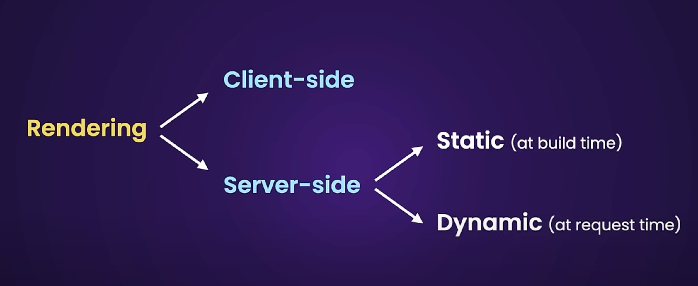
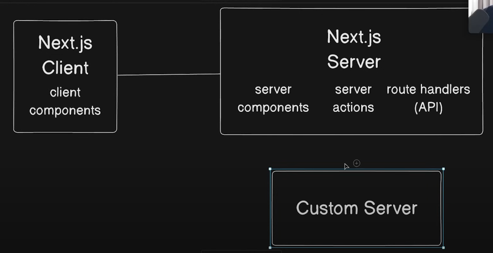

This is a [Next.js](https://nextjs.org) project bootstrapped with [`create-next-app`](https://nextjs.org/docs/app/api-reference/cli/create-next-app).

# Another boring todo app to learn next.js

## Local setup

- start the postgres db within a local docker container `docker compose up` 
- start the backend application
- run the frontend development server with `npm run dev`

Open [http://localhost:3000](http://localhost:3000) with your browser to see the result.

## Nice stuff to know

### Routing
- the new App Router works with paths (f.e. page.tsx file in dir /user creates a page on localhost:3000/user)
- <Link> Component to navigate to another page (only new page is loaded from server than)
- For the new app router there are file conventions like „not-found.tsx“ do customize the error page for 404 error
- Dynamic routes based on file system introducing a dir structure like /user/[userId]/page.tsx

### Styling
- CSS Module extension: <name>.module.css
- In Component: import styles from „./<name>.module.css“
- Names of css classes should not be like name-container, better nameContainer so it’s a valid js object property name
- PostCSS transforms style class names to unique, generated ones so nothing can crash
- DaisyUI: component library for Tailwind, combines tailwind classes, concept of themes (active in tailwind config file)
- Use <Image> component by next.js to optimize image load and performance 

### Server Side Rendering
- next.js uses SSR (Server Side Rendering per default)
- Client Component necessary f.e. for interactivity (button action)
- first line directive ‚use client‘; (other inner components becomes automatically client components, not necessarily to use this directive again)
- rule: only use client component if it is absolutely necessary (f.e. extract button to own component, the rest is still rendered on the server)
- Instead of using something like react query in the client we only can use fetch(„url“) on the backend to fetch some data from server

### State Management
- still needed if the client side get less complex? [you can find a good overview here](https://www.youtube.com/watch?v=VenLRGHx3D4&t=602s)
- idea: it is possible to map state logic to url (especially using SSR)

### Server Actions
- 'use server'; directive on top of function body (Server Component)
- to call a Server Action in a Client Component, create a new file and add the "use server" directive at the top of it
- with the method `revalidateTag("tagname")` next.js revalidates the local cache by tag

### Backend
- I can still use a custom server written with kotlin etc. (long-running server)
- a deployed next.js app on Vercel will create serverless functions (only pay what you use)
- serverless functions useful for small tasks (not for long-running tasks, chron jobs etc.)

## Database
- used a local postgres database that runs in a docker container.
- introduced Flyway for possible data migrations.
- It's not allowed to use a table name like "user" because it's a reserved keyword in PostgresDB
- Flyway is not compatible with the newest version of postgres

